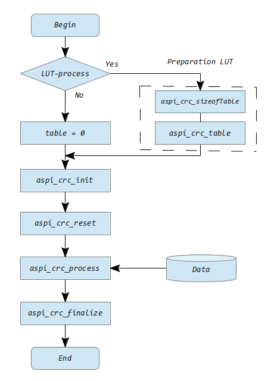
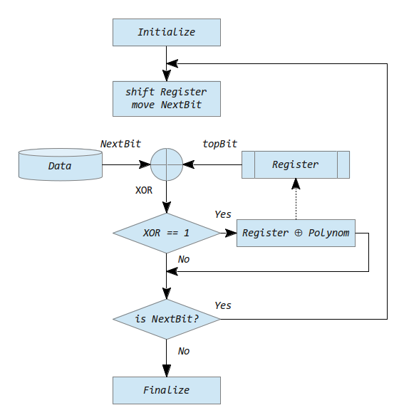
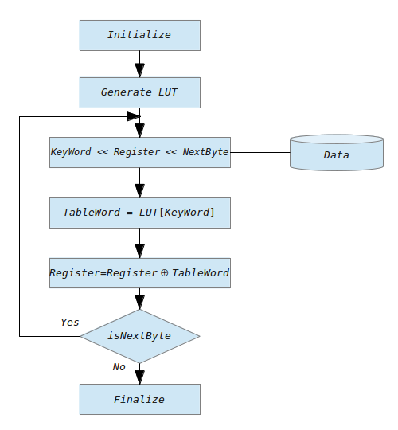
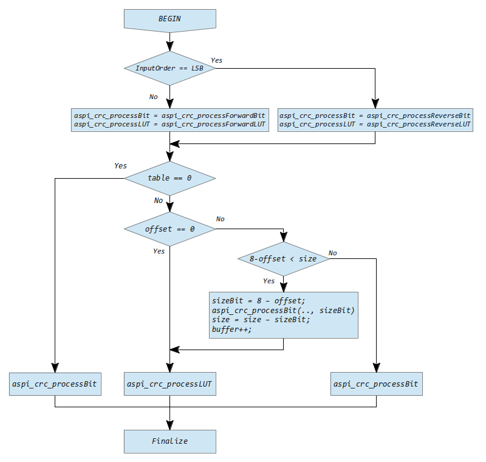

# CRC Generic library
<p align="center">
	<a href="https://gcc.gnu.org/" rel="nofollow">
		
	</a>
	<a href="https://osdn.net/projects/mingw/" rel="nofollow">
		
	</a>
	<a href="https://github.com/SergejBre/CRC/releases">
		
	</a>
	<a href="https://github.com/SergejBre/CRC/releases">
		
	</a>
	<a href="https://github.com/SergejBre/CRC/issues">
		
	</a>
	<a href="https://sergejbre.github.io/CRC/doc/html/index.html">
		
	</a>
	<a href="https://github.com/SergejBre/CRC/blob/main/LICENSE">
		
	</a>
</p>

## Contents
* [Specification](#Specification)
* [Installation instructions](#Installation-instructions)
* [Directory structure](#Directory-structure)
* [CRC Generic Library Interface](#CRC-Generic-Library-Interface)
* [CRC Generic process workflow](#CRC-Generic-process-workflow)
* [The Basics of CRC calculation of the residual value and Examples](#The-Basics-of-CRC-calculation-of-the-residual-value-and-Examples)
  * [LFSR Algorithm CRC Algorithm with the linear feedback shift register](#LFSR-Algorithm-CRC-Algorithm-with-the-linear-feedback-shift-register)
  * [LUT Algorithm CRC Algorithm with the lookup table](#LUT-Algorithm-CRC-Algorithm-with-the-lookup-table)
  * [CRC Generic Algorithm api_crc_process](#CRC-Generic-Algorithm-api_crc_process)
* [Build process and integration of the CRC Generic library in applications](#Build-process-and-integration-of-the-CRC-Generic-library-in-applications)
  * [Optimization and Performance of the CRC Process](#Optimization-and-Performance-of-the-CRC-Process)
  * [The test concept](#The-test-concept)
  * [Run tests](#Run-tests)
* [Documentation](#Documentation)
* [Tutorium for CRC Generic library](#Tutorium-for-CRC-Generic-library)
* [License](#License)

## Specification
The [cyclic redundancy check](https://en.wikipedia.org/wiki/Cyclic_redundancy_check) (CRC) is a method for determining a check value for data in order to detect errors in transmission or storage binary data. Ideally, the process can even correct the received data automatically to avoid retransmission. The CRC Generic library is designed as a universal solution for most practical CRC methods and provides a flexible API for communication application developers.

The following features are offered of the CRC library (see also part [CRC Generic process workflow](#CRC-Generic-process-workflow):
* A interface for setting CRC process and the initiation of relevant data
* Check and validation of the initial data
* The use of all relevant generators polynomials up to and including *CRC-64*
* Works with any data formats (MSB, and LSB order of the significant bits)
* The library processed the data streams with a offset .

The library is currently available as:
* 64-bit Linux static library (*lib/libCRC_generic_static.a*)
* 64-bit Linux shared library (*lib/libCRC_generic_dynamic.so*) .

The library is created and can be used with the GNU GCC compiler (version 4.7 or newer) under Linux or with the MinWG GNU compiler (version 4.8 or newer) under Windows. The installation process is described [below](#Installation-instructions).

[](#Contents)
____
## Installation instructions
The library is built and can be used with GNU compiler gcc (version 4.7.2 or newer) and 64-bit GNU/Linux.

For the installation user privileges are sufficient, except if additional linux packages have to be installed. In the following, we denote user privileges with a dollar sign ('$') and root privileges with a hash sign ('#').

Based on a clean Linux 64-bit with standard system utilities please install:
```
# apt-get install build-essential
```
Check version of gcc:
```
$ gcc -v
...
gcc version 4.7.2 (Debian 4.7.2-5)
```
Extract CRC-Generic library, which is delivered as a compressed tar archive. It is assumed that the CRC-Generic library is extracted in the user's home directory with the path name as shown below. This path name is used for the rest of this document, but a different path name can be used without restrictions.
```
~$ tar -xvf CRCgeneric_release_YYYY-MM-DD.tar.xz -C ~/
~$ cd crc
~/CRC$ ls
cfg doc fig inc lib LICENSE  make.sh  README.md src tst tut
```
See also [Directory structure](#Directory-structure).

[](#Contents)
____
## Directory structure
The following directories and files are part of the CRC-Generic library:
```
~/CRC
    |
    +--/.git (git repository)
    |
    +--/cfg (Configuration)
    |     |
    |     +--api_crc_cfg.h (Configuration head file for the CRC-Generic library)
    |
    +--/doc (Documentation)
    |     |
    |     +--Projekt CRC-Generic.pdf (Grundlagen und Beschreibung vom CRC-Prozess)
    |     |
    |     +--Tutorium for CRC.pdf (Tutorial for the CRC-Generic library)
    |
    +--/fig (Figures to CRC-Generic project)
    |     |
    |     +--CRC-Generic_algorithmLFSR.png (algorithm LFSR picture)
    |     |
    |     +--CRC-Generic_CRCprocess.png (CRC-Process picture)
    |     |
    |     +--CRC-Generic_LUTprocess.png (LUT-Process picture)
    |     |
    |     +--CRC-Generic_processOverview.png (Overview process picture)
    |     |
    |     +--Direct Forward LUT Algorithm.png
    |     |
    |     +--Direct Straightforward SR Algorithm.png
    |     |
    |     +--Division-Register.png
    |     |
    |     +--Reflected Table-Driven.png
    |     |
    |     +--Reversed LUT Algorithm.png
    |     |
    |     +--Reversed Straightforward SR Algorithm.png
    |     |
    |     +--Table-Driven.png
    |
    +--/inc (Header files for the CRC-Generic library)
    |     |
    |     +--api_crc.h (head file for the CRC-Generic library)
    |     |
    |     +--api_crc_process.h (head file for the CRC-Generic library. Process functions)
    |
    +--/lib (directory for object files and build results (static and dynamic library)
    |     |
    |     +--libCRC_generic_dynamic.so (symbolic link for dynamic CRC-Generic library)
    |     |
    |     +--libCRC_generic_dynamic.so.1 (symbolic link for dynamic CRC-Generic library)
    |     |
    |     +--libCRC_generic_dynamic.so.1.x.y (dynamic CRC-Generic library)
    |     |
    |     +--libCRC_generic_static.a (static CRC-Generic library)
    |
    +--/src (Source files for the CRC-Generic library)
    |     |
    |     +--api_crc.c (source file for the CRC-Generic library)
    |     |
    |     +--api_crc_process.c (source file for the CRC-Generic library. Process functions)
    |
    +--/tst (Tests to the CRC-Generic project, directory for tests files)
    |     |
    |     +--tests.c (source file for Unit-Test)
    |
    +--/tut (Tutorial to the CRC-Generic project)
    |     |
    |     +--examples.h (head file for Examples)
    |     |
    |     +--examples.c (source file for Examples)
    |     |
    |     +--examples*_in.bin (input data file for Examples*)
    |     |
    |     +--examples*_out.bin (output data file for Examples*)
    |
    +--LICENSE
    |
    +--make.sh (make file for the CRC-Generic library)
    |
    +--README.md
```

[](#Contents)
____
## CRC Generic Library Interface
The Interface of the CRC Generic library consists of the 6 public functions:
* The initialization function: *api_crc_init*
* The LUT table function: *api_crc_table*
* The function gives size of the table back: *api_crc_sizeofTable*
* The method for cleaning of old data: *api_crc_reset*
* The method for calculate the CRC proof sum: *api_crc_process*
* The method for return the requested CRC value: *api_crc_finalize*
```c
// The initialization function is used to fill the data necessary for the calculation CRC.
api_crc_status_e api_crc_init(uint64_t const		polynomial,
                               uint64_t const		inputXOR,
                               uint64_t const		outputXOR,
                               uint64_t const *const	table,
                               api_crc_order_e const	inputOrder,
                               api_crc_order_e const	outputOrder,
                               api_crc_device_s *const 	device
                               );

// The function fills the LUT table with the previously calculated values.
api_crc_status_e api_crc_table(api_crc_device_s * 	device,
                               uint64_t *const		table,
                               uint16_t 		size
                               );

// This function returns the size of LUT table.
uint16_t api_crc_sizeofTable(uint64_t const 	polynomial);

// The method used to api_crc_reset cleaning of old data.
api_crc_status_e api_crc_reset(api_crc_device_s const *const 	device,
                               api_crc_state_t *const		state
                               );

// The method calculates the CRC proof sum.
api_crc_status_e api_crc_process(api_crc_device_s const *const	device,
                                 api_crc_state_t *const 	state,
                                 uint8_t const *const		buffer,
                                 uint8_t const			offset,
                                 uint32_t const			size
                                 );		

// This method returns the requested value and taking order predetermined values outputOrder,
// outputOrder and the value outputXOR.
api_crc_status_e api_crc_finalize(api_crc_device_s const *const	device,
                                  api_crc_state_t *const 	state 
                                  );
```
a data structure: *api_crc_device_s*
```c
// Device structure for calculating a Cyclic Redundancy Code (CRC) checksum.
typedef struct
{
   // Generator polynomial for calculating the CRC checksum.
   uint64_t polynomial;
   // Initial value for XORing with the polynomial division state register.
   uint64_t inputXOR;
   // Final value for XORing with the polynomial division state register.
   uint64_t outputXOR;
   // Lookup table for processing one input byte per iteration.
   uint64_t const *table;
   // Bit order for processing input bytes.
   api_crc_order_e inputOrder;
   // Bit order for storing the CRC checksum.
   api_crc_order_e outputOrder;
} api_crc_device_s;
```
and a state variable: *api_crc_state_t*
```c
// State register for storing intermediate as well as the final value of the Cyclic Redundancy Code (CRC)
// checksum calculation.
typedef uint64_t api_crc_state_t;
```
The detailed description of the methods is in the documentation section API_LIBRARY_CRC_INTERFACE

[](#Contents)
____
## CRC Generic process workflow
The preparation for the CRC process and the flow of the CRC process work according to the below added scheme. Here are the explanations of the functions and methods that are needed to the CRC process:
* The function *api_crc_init* is required for the initialization and determination of the CRC process.
* The functions *api_crc_sizeofTable* and *api_crc_table* are required exclusively for the LUT process.
* The function *api_crc_reset* is a useful tool for next cases:
  * a new initial value *inputXOR* to set in the register,
  * in order to clean register from the old data.
* The function *api_crc_process* is required for the CRC Processing.
* The function *api_crc_finalize* you need for CRC value output.



[](#Contents)
____
## The Basics of CRC calculation of the residual value and Examples
The Basics of Polynomial Arithmetic Modulo 2, the CRC-Calculation, the CRC-Process and the CRC-Algorithms can be found in the attached script <b>Projekt CRC-Generic.pdf</b> or in the section [Tutorium](#Tutorium-for-CRC-Generic-library). Here are only the most important things, which are based on CRC calculation and CRM processes.
### LFSR Algorithm CRC Algorithm with the linear feedback shift register
For the purposes of example, consider a polynom of the order 4 and the polynom = 10111 (0x7). Then, the perform the division, we need to use a 4-bit register:
```
      +----<- Data (non augmented)               Algorithm
      |                                          ---------
      v         3    2    1    0   Bits          1. Shift the register left by
      |      +----+----+----+----+                  one bit, reading in a new
     XOR---<-|    |    |    |    | Register         data bit.
             +----+----+----+----+               2. XOR the top bit just rotated
                       ^                            out of the register with the
                       |                            next data bit, if XOR != 1
  if(XOR==1) Register XOR Polynom                   then goto 1.
                       |                         3. XOR the polynomial into the
              ---------+----------                  register.
          (1)   0    1    1    1   Polynom       4. Goto 1 iff more augmented
                                                    data bits.
```
The following block diagram shows the principle of the LFSR-Algorithm.


### LUT Algorithm CRC Algorithm with the lookup table
For the purposes of example, let us switch from a 4-bit poly to a 32-bit one (CRC32). Our register looks much the same, except the boxes represent bytes instead of bits, and the Poly is 33 bits (one implicit 1 bit at the top and 32 "active" bits).
```
          +-----< Data (non augmented)
          |
          v         3    2    1    0   Bytes
          |      +----+----+----+----+
         XOR----<|    |    |    |    | Register
          |      +----+----+----+----+
          |                ^
          |                |
          |               XOR
          |                |           LUT
          |     0+----+----+----+----+       Algorithm
          v      +----+----+----+----+       ---------
          |      +----+----+----+----+       1. Shift the register left by
          |      +----+----+----+----+          one byte, reading in a new
          |      +----+----+----+----+          data byte.
          |      +----+----+----+----+       2. XOR the top byte just rotated
          |      +----+----+----+----+          out of the register with the
          +----->+----+----+----+----+          next data byte to yield an
                 +----+----+----+----+          index into the table ([0,255]).
                 +----+----+----+----+       3. XOR the table value into the
                 +----+----+----+----+          register.
                 +----+----+----+----+       4. Goto 1 iff more augmented
              255+----+----+----+----+          data bytes.
```
The following block diagram shows the principle of the LUT-Algorithm.


### CRC Generic Algorithm api_crc_process
The following block diagram shows the principle of the CRC-Generic Algoritm *api_crc_process*


[](#Contents)
____
## Build process and integration of the CRC Generic library in applications
The CRC Generic library uses a shell-script make.sh , which then compiles and builds CRC-Generic library and tests.

These commands are aimed at optimizing compiler run­time calculation of CRC.
```
~/CRC$ ./make.sh
This script compiles and builds CRC-Generic library, Examples and Tests.

Prerequisites: 1) GNU compiler gcc (version >= 4.7.2) (gcc --version)
                  Compiled CRC-Generic library, Examples and Tests.
               2) Selection of the macro -D OPTIMIZE for:
                  performance =BUILD_FOR_PERFORM
                  code size =BUILD_FOR_SIZE
                  data size =BUILD_FOR_DATA
                  debug =BUILD_FOR_DEBUG

gcc FLAGS: -pipe -O2 -Wall -W -fPIE -DOPTIMIZE=BUILD_FOR_PERFORM
gcc PFLAGS for crc-process: -pipe -funroll-loops -O3 -Wall -W -fPIE
Compile and build CRC-Generic static library
build libCRC_generic_static.a ..

BUILD_FOR_PERFORM
Compile and build CRC-Generic dynamic library
build libCRC_generic_dynamic.so ..

Compile and build the Tests
build CRC_static_tests
build CRC_dynamic_tests
build CRC_profiling
```
The *tst/tests.c* file also show how the static library of the CRC-Generic library can be integrated into applications. Of course, one can always create own C/C++ projects and use the CRC-Generic library.

After [Installation instructions](#Installation-instructions), static/dynamic library, examples and tests can be built with:
```
~/$ cd crc/lib
~/CRC/lib$ gcc -c -pipe -O3 -Wall -W ../src/api_crc.c
~/CRC/lib$ ar r libCRC_generic_static.a api_crc.o
```
For the dynamic library *libCRC_generic_dynamic.so*
```
~/$ cd CRC/lib
~/CRC/lib$ gcc -c -pipe -O3 -Wall -W -fPIC ../src/api_crc.c
~/CRC/lib$ gcc -shared -o libCRC_generic_dynamic.so api_crc.o
```
The resulting object files and binaries are available in the *~/CRC/lib* directory.
```
api_crc.o  libCRC_generic_dynamic.so  libCRC_generic_static.a
```
If necessary, clean object files with:
```
~/CRC/lib$ rm *.o
~/CRC/lib$ ls
libCRC_generic_dynamic.so  libCRC_generic_static.a
```
For the tests *CRC_generic_test*
```
~/$ cd CRC/tst
~/CRC/tst$ gcc -c -pipe -O3 -Wall -W tests.c
~/CRC/tst$ gcc -o CRC_generic_tests *.o -L../lib -lCRC_generic_static
```
The resulting object files and binaries are available in the *~/CRC/tst* directory.

### Optimization and Performance of the CRC Process
The script make.sh for building the library initially assumes various ways to optimize the executable code. So, it provides the ability to:
1. optimize the size of the binary code,
2. the size of the data used (load on the stack) and
3. the computational performance.

To do this, you must uncomment the lines in the appropriate place in the script make.sh.
```sh
################################################################################
# Compile and build CRC-Generic library and tests
################################################################################

#gcc FLAGS for Optimization of Code Size
#CFLAGS="-pipe -Os -Wall -W -fPIE -DOPTIMIZE=BUILD_FOR_SIZE"

#gcc FLAGS for Optimization of Data
#CFLAGS="-pipe -O2 -Wall -W -fPIE -DOPTIMIZE=BUILD_FOR_DATA"

#gss FLAGS for Optimization of Performance
CFLAGS="-pipe -O2 -Wall -W -fPIE -DOPTIMIZE=BUILD_FOR_PERFORM"

#gss FLAGS for Debug build of CRC library
#CFLAGS="-pipe -g -Wall -W -fPIC -DOPTIMIZE=BUILD_FOR_DEBUG"
```
For profiling CRC processes and methods, you can use the *gcc* *gprof* tool. To do this, you need to recompile the CRC library with the additional *-pg* option. For instance:
```
~/CRC/lib$ gcc -c -pg -O2 -Wall -W ../src/api_crc.c
~/CRC/lib$ ar  r libCRC_generic_static.a api_crc.o
~/CRC/lib$ cd ../tst
~/CRC/tst$ gcc tests.c -pg -o CRC_profiling -O2 -L../lib -lCRC_generic_static
```
Running the profiled library gives information about the distribution of time between processes:
```
~/CRC/tst$ ./CRC_profiling
~/CRC/tst$ gprof CRC_profiling gmon.out -p
Flat profile:

Each sample counts as 0.01 seconds.
  %   cumulative   self              self     total           
 time   seconds   seconds    calls  ms/call  ms/call  name    
 89.04      0.24     0.24      525     0.46     0.46  api_crc_processForwardBit
  7.42      0.26     0.02        3     6.68    10.02  api_crc_processForwardLUT
  3.71      0.27     0.01  1966080     0.00     0.00  api_crc_readForwardTable32
  0.00      0.27     0.00      256     0.00     0.00  api_crc_writeForwardTable16
  0.00      0.27     0.00      256     0.00     0.00  api_crc_writeForwardTable32
  0.00      0.27     0.00        7     0.00     0.00  api_crc_finalize
  0.00      0.27     0.00        7     0.00     5.14  api_crc_process
  0.00      0.27     0.00        7     0.00     0.00  api_crc_reset
  0.00      0.27     0.00        4     0.00     0.00  api_crc_readForwardTable16
  0.00      0.27     0.00        2     0.00     0.00  api_crc_reverse64
  0.00      0.27     0.00        1     0.00     0.00  api_crc_processReverseBit
```

### The test concept
Unit test is used to verifiability of the code of the interface functions.
- Testing the interface of the CRC library,
- Test of the CRC-algorithms,
- Performance tests.

The testing program consists of three test blocks:
1. Block tests the CRC library interface. The function arguments of public functions are tested in accordance with the validity and the value fields.
2. Block is intended for testing of CRC algorithms. Here the method Directly Forwad / Reverse LFSR and LUT Forward / Reverse process in the separate tests cases are tested.
3. Block tests the performance of different CRC (Direcktly and LUT) method based on the CRC32 polynomial.

⚠️ Note: The tests are also recommended as further examples on how to use the CRC-Generic library. See [Build process and integration of the CRC Generic library in applications](#Build-process-and-integration-of-the-CRC-Generic-library-in-applications).

### Run tests
Tests are run as follows:
```
~/CRC cd tst
~/CRC/tst$ ./CRC_generic_tests
```
The successful test result looks like this:
1. Block (Testing the interface of the CRC library)
```
/******************************************************************************/
/* Test Case 1.1.                                                             */
/* Review of api_crc_init(polynomial,inputXOR,outputXOR,table,inputOrder,...) */
/******************************************************************************/
Status of api_crc_init(polynomial,inputXOR,outputXOR,table,inputOrder,...) is Ok


/******************************************************************************/
/* Test Case 1.2.                                                             */
/* The review for the function api_crc_table(device, table, size)             */
/******************************************************************************/
Status of api_crc_table(device, table, size) is Ok


/******************************************************************************/
/* Test Case 1.3.                                                             */
/* The review for the function api_crc_sizeofTable(polynomial)                */
/******************************************************************************/
Status of the function api_crc_sizeofTable(polynomial) is Ok


/******************************************************************************/
/* Test Case 1.4.                                                             */
/* The review for the function  api_crc_reset(device, state)                  */
/******************************************************************************/
Status of api_crc_reset(&device, &state) is Ok


/******************************************************************************/
/* Test Case 1.5.                                                             */
/* Review for function api_crc_process(device, state, buffer, offset, size)   */
/******************************************************************************/
Size of buffer in Bits = 8
Status of api_crc_process(device, state, buffer, offset, size) is Ok


/******************************************************************************/
/* Test Case 1.6.                                                             */
/* The review for the function api_crc_finalize(device, state)                */
/******************************************************************************/
Status of api_crc_finalize(&device, &state) is Ok
```
2. Block (Test of CRC­algorithms)
```
/******************************************************************************/
/* Test Case 2.1.                                                             */
/* CRC-16                                                                     */
/* generator polynomial: G(x) = x^16 + x^15 + x^2 + 1                         */
/* initial:              0b0000000000000000 (0x00)                            */
/* outputXOR:            0b0000000000000000 (0x00)                            */
/* Bits Order:           LSB                                                  */
/* data:            0x31 0x32 0x33 0x34 0x35 0x36 0x37 0x38 0x39              */
/* CRC-16:          0xBB3D                                                    */
/******************************************************************************/
api_crc_reset status code = 0
buffer_size in Bits = 72
api_crc_process status code = 0
CRC Rest (state) = bb3d
api_crc_finalize status code = 0
CRC Rest = bb3d
/******************************************************************************/
/* Output for Check function output_Check(crc_Value, state)                   */
/******************************************************************************/
The review of the process was needed, because the checksums match: bb3d = bb3d

...
```
3. Block (Performance tests)
```
/******************************************************************************/
/* Test Case 3.1.                                                             */
/* Performance Test for CRC-32 Forward LFSR                                   */
/******************************************************************************/
api_crc_init status code = 0
api_crc_reset status code = 0
api_crc_process status code = 0
api_crc_finalize status code = 0
CRC Rest = 57b403d1
/******************************************************************************/
/* Output for Check function output_Check(crc_Value, state)                   */
/******************************************************************************/
The review of the process was needed, because the checksums match: 57b403d1 = 57b403d1

Processing for 15728640 bits took 0.102956 seconds
The speed of Processing 152770.50 bits per millisecond


/******************************************************************************/
/* Test Case 3.2.                                                             */
/* Performance Test for CRC-32 Reverse LFSR                                   */
/******************************************************************************/
api_crc_init status code = 0
api_crc_reset status code = 0
api_crc_process status code = 0
api_crc_finalize status code = 0
CRC Rest = 4c36d339
/******************************************************************************/
/* Output for Check function output_Check(crc_Value, state)                   */
/******************************************************************************/
The review of the process was needed, because the checksums match: 4c36d339 = 4c36d339

Processing for 15728640 bits took 0.086525 seconds
The speed of Processing 181781.45 bits per millisecond

...
```

[](#Contents)
____
## Documentation
For the detailed API documentation, follow link - [](https://sergejbre.github.io/CRC/doc/html/index.html)

[](#Contents)
____
## Tutorium for CRC Generic library
TODO

[](#Contents)
____
## License
[](LICENSE)
